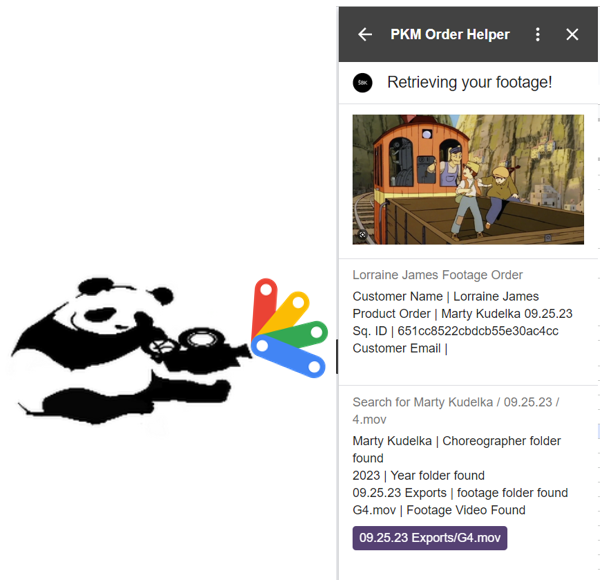

<!-- PROJECT LOGO -->
 

  

  <h3 align="center">Order Fulfillment Google Workspace Add-On</h3>

<!-- ABOUT THE PROJECT -->
## About The Project
PandaKo Media needed a faster way to fulfill Squarespace orders. 

![][ordering] 

(<a href="#readme-top">back to top</a>)

### Built With
* [![JavaScript][JavaScript]][JavaScript-url] - Clasp transpiles JS code to GAS.

<!-- GETTING STARTED -->
## Getting Started

(<a href="#readme-top">back to top</a>)

<!-- MARKDOWN LINKS & IMAGES -->
<!-- https://www.markdownguide.org/basic-syntax/#reference-style-links -->

[ordering]: ./images/ordering.gif

[solution]: ./images/sorted.gif

[JavaScript]: https://img.shields.io/badge/JavaScript-F7DF1E?style=for-the-badge&logo=javascript&logoColor=black
[JavaScript-url]: https://developer.oracle.com/languages/javascript.html
